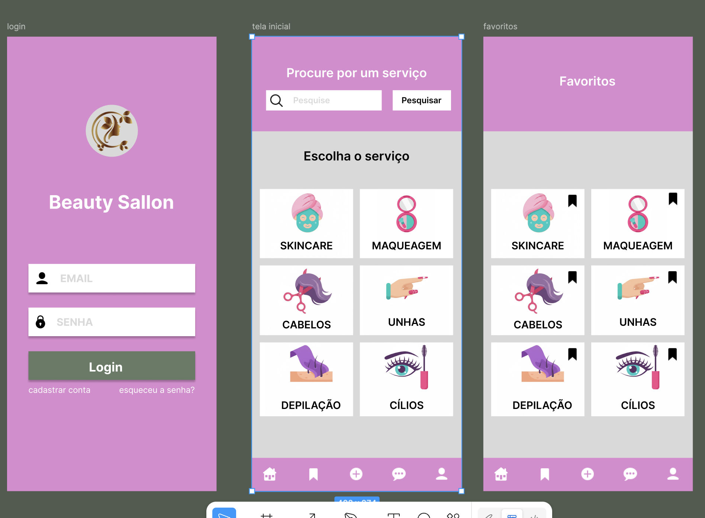

# Beauty Sallon - App de Agendamento de Estética
> **Projeto Académico** desenvolvido para a disciplina de [Nome da Disciplina] na [Nome da Instituição/Faculdade].

## 📌 Visão Geral
O **Beauty Sallon** é um protótipo criado no Figma, focado em centralizar e simplificar o agendamento de serviços de beleza e bem-estar. O projeto explora a jornada do usuário desde a descoberta de novos procedimentos até à escolha.

---

## 👤 Personas & Clusters de Utilizadores
O design foi fundamentado em três padrões de comportamento identificados durante a fase de pesquisa:

* **A Fiel (Pragmática):** Foca-se na rapidez. Utiliza a aba de **Favoritos** para repetir agendamentos de rotina sem passar pelo fluxo de descoberta.
* **A "Garimpeira" de Novidades (Beatriz, 22 anos):** Estudante que procura tendências e novos serviços. Utiliza intensamente a **Barra de Pesquisa** e as categorias, mas sente insegurança se não houver provas sociais (avaliações).
* **A Planeadora:** Utiliza o sistema de favoritos como uma *wishlist* para organizar futuros gastos e eventos especiais.

---

## 💡 Proposta de Valor
A proposta central do projeto é oferecer **conveniência e autonomia** no autocuidado:
* **Hub Centralizado:** Acesso a múltiplos serviços (Cabelo, Unhas, Skincare) numa única interface.
* **Agilidade:** Redução do tempo de marcação através de uma hierarquia visual clara.
* **Personalização:** Experiência moldada pelo histórico e preferências do utilizador (Favoritos).

---

## 🛠️ O que foi desenvolvido
* **Fluxo de Autenticação:** Tela de Login e Registo com foco em conversão.
* **Tela Inicial (Home):** Sistema de navegação por categorias visuais e motor de busca em destaque.
* **Tela de Favoritos:** Interface dedicada para acesso rápido aos serviços marcados pelo utilizador.

---

## 🔍 UX Insights (Análise Crítica)
Como parte do exercício académico, foram identificados pontos de melhoria para futuras iterações:
* **Transparência de Dados:** Necessidade de incluir preços e notas de avaliação diretamente nos cards para reduzir a paralisia de escolha.
* **Acesso de Convidado:** Reduzir a fricção inicial permitindo que o utilizador explore os serviços antes de realizar o login obrigatório.

---

## 🚀 Ferramentas Utilizadas
* **Figma:** Prototipagem de alta fidelidade e design de interface.
* **UX Research:** Criação de personas, mapeamento de dores e definição de clusters de perfil.

---

## 🔗 Acesso ao Projeto
* **Protótipo Navegável (Figma):** [https://www.figma.com/proto/mHzMFZahvK9JYwX05q5EWe/prototipagem-wireframes?t=thThbu9thL6wKHzb-1]

---
*Este é um projeto com fins exclusivamente educativos.*
